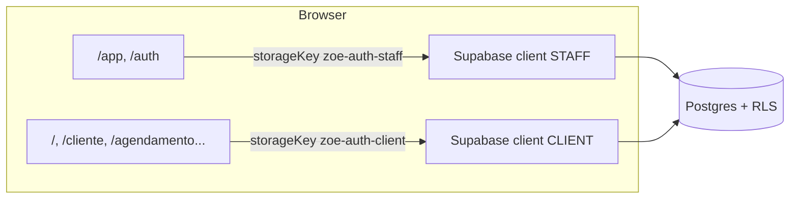
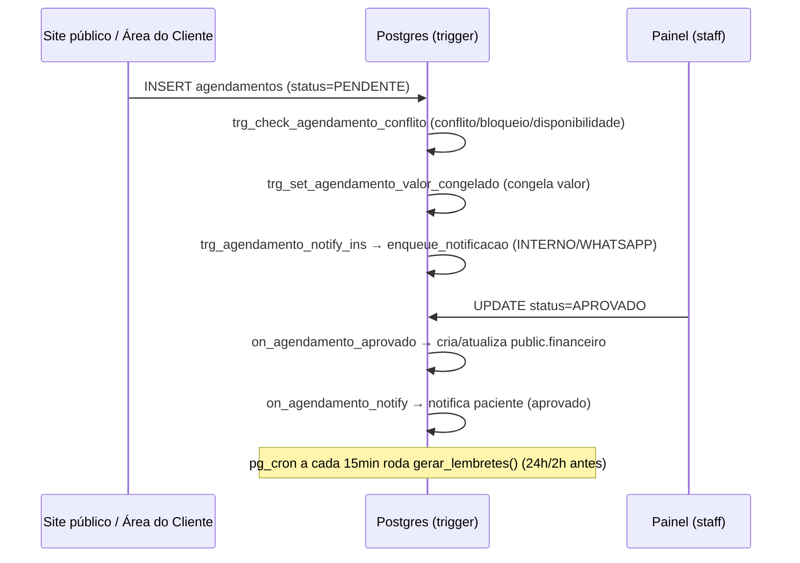

# CLAUDE.md — Clínica Zoe

> Contexto global de engenharia para qualquer sessão do Claude Code neste
> repositório. Leia isto antes de tocar em qualquer arquivo. As Skills em
> `.claude/skills/*` complementam este documento com playbooks específicos por
> domínio — use `CLAUDE.md` para as regras estruturais e as Skills para o
> "como fazer" de cada área.

## 1. Visão geral do sistema

**Clínica Zoe** é um sistema administrativo completo para uma clínica, com um
site público de captação de pacientes. Não é um template genérico: é uma
aplicação de produção com dados reais de agendamentos, pacientes e finanças.

O sistema tem três áreas com sessões de autenticação **independentes**:

| Área | Rotas | Público | Sessão |
| --- | --- | --- | --- |
| Site público | `/`, `/especialidades`, `/profissionais`, `/sobre`, `/contato`, `/agendamento` | Visitantes e pacientes | escopo `client` |
| Área do Cliente | `/cliente`, `/cliente/login` | Pacientes autenticados | escopo `client` |
| Painel Administrativo | `/app/*`, `/auth` | Equipe (ADMIN, RECEPCIONISTA, PROFISSIONAL) | escopo `staff` |

Um único banco Postgres (Supabase) serve as três áreas. A separação de acesso
é feita inteiramente por **Row Level Security (RLS)** e por **papéis**
(`app_role`: `ADMIN`, `RECEPCIONISTA`, `PROFISSIONAL`, `CLIENTE`) — nunca por
lógica de UI isolada. Ver [[permissions]] e [[authentication]].

### Módulos funcionais

- **Agenda**: agendamento de consultas, bloqueios de horário, disponibilidade
  semanal por profissional, verificação de conflito no banco (trigger).
- **Solicitações**: fila de agendamentos `PENDENTE` aguardando aprovação da
  recepção/profissional/admin.
- **Pacientes**: cadastro, histórico de consultas, avatar.
- **Profissionais**: cadastro, especialidade, valores de consulta (à vista e
  cartão), disponibilidade, bloqueios.
- **Financeiro**: lançamentos criados automaticamente quando um agendamento é
  aprovado (trigger `on_agendamento_aprovado`), nunca manualmente pela UI para
  o caso padrão.
- **Usuários**: CRUD de contas da equipe, papéis, desativação/remoção segura
  (soft delete), auditoria (`user_audit_log`).
- **Notificações**: fila multicanal (`INTERNO`, `WHATSAPP`, `EMAIL`) gerada
  por triggers de banco a cada mudança relevante de estado.
- **WhatsApp**: hoje, links `wa.me` gerados no cliente (sem API paga). Há
  tabelas prontas (`whatsapp_meta_config`, `whatsapp_templates`,
  `whatsapp_message_logs`, `whatsapp_queue`) para uma futura integração via
  WhatsApp Cloud API — **essas tabelas ainda não têm rotas server-side
  consumindo-as**; não assuma que a integração está ativa.
- **Site público**: home, especialidades, profissionais, contato, wizard de
  agendamento — todo o conteúdo institucional vem de
  `configuracoes_clinica`, editável em `/app/configuracoes`.

## 2. Stack

| Camada | Tecnologia | Observação |
| --- | --- | --- |
| Framework | TanStack Start 1.x | SSR + roteamento por arquivo, sobre Vite |
| Runtime alvo | Cloudflare Workers (padrão) / Vercel / Netlify | Ver `NITRO_PRESET`; sem `child_process`, `sharp`, `canvas` no server |
| UI | React 19 | Sem Next.js, sem Remix — convenções são do TanStack Start |
| Linguagem | TypeScript 5, `strict: true` | `noUnusedLocals`/`noUnusedParameters` desligados propositalmente |
| Estilo | Tailwind CSS v4 (CSS-first, `@theme inline`) + shadcn/ui (Radix) | Cores em `oklch`, nunca hex hardcoded |
| Dados/estado servidor | TanStack Query v5 | Toda leitura/escrita ao Supabase passa por `useQuery`/`useMutation` |
| Formulários | `react-hook-form` + `zod` (a maioria das telas usa `useState` local + `zod.parse` manual — ver [[react]]) |
| Backend | Supabase (Postgres, Auth, Storage, RLS, `pg_cron`) | Único backend; sem servidor Node separado |
| Build | Vite + `@lovable.dev/vite-tanstack-config` | **Não** adicione manualmente plugins que esse pacote já injeta (ver `vite.config.ts`) |
| Package manager | `npm` (há `bun.lock` e `bunfig.toml` também presentes; `npm` é o fluxo documentado no README) |

Este projeto é sincronizado com **Lovable** (editor visual conectado ao
repositório). Commits no branch conectado refletem no Lovable — não reescreva
histórico publicado (`push --force`, `rebase`, `amend` em commits já
enviados). Ver `AGENTS.md`.

## 3. Arquitetura

### 3.1 Fluxo de autenticação dual



`src/integrations/supabase/dual-client.ts` mantém **dois clientes Supabase
independentes** (`staff` e `client`), cada um com sua própria `storageKey` no
`localStorage`. Isso permite um recepcionista estar logado no painel **e**,
na mesma sessão de navegador, um paciente estar logado na Área do Cliente,
sem colisão. `scopeForPath(pathname)` decide o escopo pela URL. Nunca use o
Supabase client "genérico" de `src/integrations/supabase/client.ts` fora do
que já está migrado — o app real usa `@/lib/supabase` → `dual-client.ts`. Ver
[[authentication]].

### 3.2 Server functions: `*.functions.ts` vs `*.server.ts`

TanStack Start compila arquivos de rota e módulos importados por eles para o
bundle do cliente. Este projeto usa uma convenção estrita para nunca vazar a
`SUPABASE_SERVICE_ROLE_KEY` para o browser:

- **`*.functions.ts`** (ex.: `src/lib/admin.functions.ts`,
  `src/lib/users.functions.ts`): definem `createServerFn(...)` com
  `.middleware([requireSupabaseAuth])` e `.inputValidator(zodSchema.parse)`.
  São importados por rotas/componentes client-side — por isso **nunca**
  importam `supabaseAdmin` no top-level.
- **`*.server.ts`** (ex.: `src/lib/users.server.ts`,
  `src/integrations/supabase/client.server.ts`): contêm a lógica que usa
  `supabaseAdmin` (service role, bypassa RLS). São importados **apenas**
  dinamicamente (`await import(...)`) de dentro do `.handler()` de uma server
  function, nunca de um módulo client-side.

```ts
// padrão real do projeto (src/lib/admin.functions.ts)
export const adminListUsers = createServerFn({ method: "POST" })
  .middleware([requireSupabaseAuth])
  .handler(async ({ context }) => {
    const { assertAdmin, loadUsers } = await import("@/lib/users.server");
    await assertAdmin(context.supabase, context.userId);
    return loadUsers();
  });
```

Ver [[supabase]] e [[security]].

### 3.3 Modelo de permissões (RLS-first)

A autorização real vive no banco, não no frontend. Toda tabela de negócio tem
RLS habilitado e políticas que chamam `public.has_role(auth.uid(), 'ADMIN')`
ou comparam `user_id = auth.uid()`. A UI (sidebar, rotas) apenas **reflete**
essas permissões para experiência do usuário — nunca é a linha de defesa.
Qualquer alteração de tela que dependa de papel deve ter a política RLS
equivalente checada/ajustada no banco. Ver [[permissions]] e [[database]].

### 3.4 Ciclo de vida de um agendamento (exemplo do fluxo central)



Regras de negócio críticas vivem em **triggers e funções SQL**, não em código
TypeScript: conflito de horário, congelamento de valor, criação do lançamento
financeiro e disparo de notificações são todos server-side, atômicos e
não podem ser contornados por um `insert`/`update` direto do cliente. Ver
[[agenda]], [[financial]], [[notifications]].

## 4. Estrutura de pastas

```
src/
├── routes/                     Roteamento por arquivo do TanStack Start (ver src/routes/README.md)
│   ├── __root.tsx               Shell HTML, providers globais (QueryClient, Auth, Theme, Toaster)
│   ├── index.tsx                Home do site público
│   ├── especialidades.tsx, profissionais.tsx, sobre.tsx, contato.tsx
│   ├── agendamento.tsx           Wizard de agendamento (site público, exige login client)
│   ├── auth.tsx                  Login da equipe
│   ├── cliente.tsx, cliente.index.tsx, cliente.login.tsx   Área do Cliente
│   ├── app.tsx                   Layout do painel (sidebar + guard de sessão staff)
│   ├── app.index.tsx             Dashboard
│   ├── app.agenda.tsx, app.minha-agenda.tsx    Agenda (visão geral / escopo do profissional)
│   ├── app.solicitacoes.tsx      Central de aprovação de agendamentos
│   ├── app.pacientes.tsx, app.meus-pacientes.tsx
│   ├── app.profissionais.tsx, app.meu-perfil.tsx
│   ├── app.financeiro.tsx
│   ├── app.usuarios.tsx          CRUD de contas + auditoria (ADMIN only)
│   ├── app.configuracoes.tsx     Configurações da clínica (reflete no site público)
│   ├── app.conta.tsx             Segurança da própria conta (senha, e-mail)
│   ├── redefinir-senha.tsx       Fluxo de recuperação de senha
│   └── sitemap[.]xml.ts          Rota especial gerando XML
├── components/
│   ├── ui/                      shadcn/ui — não editar padrões internos sem necessidade real
│   ├── agenda/AgendaView.tsx    Componente de agenda reaproveitado por 3 rotas (agenda/minha-agenda)
│   ├── site/SiteShell.tsx       Layout + animações (`Reveal`) do site público
│   ├── security/                Diálogos de senha/segurança de conta
│   ├── media/                   Upload de avatar/imagem (Storage)
│   ├── app-sidebar.tsx          Menu do painel, filtrado por papel + badges de contagem
│   ├── auth-splash.tsx          Tela de carregamento entre sessão "loading" e "ready"
│   └── theme-toggle.tsx
├── lib/
│   ├── auth-context.tsx         Provider único de auth+roles (useAuth)
│   ├── auth-login.ts            signInGuarded (login com checagem de conta desativada)
│   ├── staff-session.ts         Detecta sessão staff ativa a partir do site público
│   ├── supabase.ts              Reexporta dual-client (ponto de entrada canônico)
│   ├── *.functions.ts           Server functions expostas ao client (ver 3.2)
│   ├── *.server.ts              Lógica admin com supabaseAdmin (nunca importar no client)
│   ├── agenda-utils.ts          Constantes/format de agenda (STATUS_LABEL, addMinutes...)
│   ├── clinic-settings.ts       useClinicSettings — configurações institucionais
│   ├── whatsapp-link.ts         Geração de links wa.me e mensagens formatadas
│   ├── sidebar-badges.ts        Contadores da sidebar (pendentes, financeiro aberto, agenda hoje)
│   ├── avatar.tsx               PersonAvatar/ProfilePhoto + signed URL de Storage
│   ├── password.ts              evaluatePassword (força de senha)
│   ├── theme.tsx                Provider de tema claro/escuro
│   └── utils.ts                 cn() (clsx + tailwind-merge)
├── integrations/supabase/       Clientes Supabase gerados/isolados (client, client.server, dual-client, auth-middleware, types)
├── styles.css                   Design tokens Tailwind v4 (oklch), único lugar de cores
├── router.tsx, server.ts, start.ts   Bootstrap do TanStack Start
└── routeTree.gen.ts             GERADO — nunca editar manualmente

supabase/
├── migrations/                  Histórico cronológico de migrações SQL (não reescrever migrações antigas)
└── portable/                    Pacote portátil: 01_extensions, 02_schema_public (fonte da verdade do schema atual), 03_storage

.claude/
├── CLAUDE.md                    Este arquivo
└── skills/                      Playbooks por domínio
```

## 5. Convenções de código

### 5.1 Nomenclatura

- **Banco de dados**: tabelas, colunas, enums e funções em **português**,
  `snake_case` (`agendamentos`, `profissional_id`, `status_pagamento`,
  `has_role`). Mantenha essa convenção em qualquer nova tabela/coluna.
- **TypeScript/React**: identificadores de código (variáveis, funções,
  componentes, tipos) em **inglês ou português conforme o arquivo já usa** —
  este projeto mistura os dois deliberadamente: nomes de domínio
  (`paciente`, `profissional`, `agendamento`, `solicitacao`) permanecem em
  português porque espelham as tabelas; nomes técnicos genéricos (`loading`,
  `handler`, `mutation`, `query`) ficam em inglês. Siga o arquivo em que você
  está editando — não traduza nomes de domínio existentes.
- **Componentes**: `PascalCase.tsx` (`AgendaView.tsx`, `AppSidebar` →
  arquivo `app-sidebar.tsx` em kebab-case — componentes de página/layout usam
  kebab-case de arquivo, componentes de feature reutilizáveis usam
  PascalCase de arquivo; siga o padrão já presente na pasta).
- **Rotas**: seguem estritamente a convenção do TanStack Start — ver
  `src/routes/README.md` e [[react]]. Rotas do painel são prefixadas
  `app.*.tsx` (equivalente a `/app/*`), nunca uma subpasta `app/`.
- **Server functions**: prefixo do domínio + verbo (`adminListUsers`,
  `adminSetUserActive`, `adminCreateUser`). Arquivo par `X.functions.ts` /
  `X.server.ts` com o mesmo radical.

### 5.2 Padrões de código gerais

- TypeScript `strict`. Não introduza `any` novo sem necessidade — o código
  legado usa `any` em pontos pontuais (linhas de query com `select` com
  joins), mas prefira tipar quando praticável usando `Database` de
  `integrations/supabase/types.ts`.
- Sem classes de estado — componentes são funções, hooks do React.
  `useState` local é o padrão para formulários simples; `react-hook-form` só
  aparece via `@/components/ui/form.tsx` quando o formulário já existir nesse
  padrão.
- Toda leitura ao Supabase no client passa por `useQuery`
  (`@tanstack/react-query`) com `queryKey` explícita e granular (ex.:
  `["agenda", data, profissionalId]`). Toda escrita passa por `useMutation`
  com `onSuccess` invalidando as `queryKey`s afetadas — nunca deixe a UI
  desatualizada após uma mutação.
- `toast.success` / `toast.error` (sonner) para feedback de mutações. Erros
  do Supabase devem ser exibidos com a mensagem original (`error.message`)
  sempre que fizer sentido para o usuário — mensagens de erro de RLS/trigger
  em português já são amigáveis (ex.: "Fora da disponibilidade do
  profissional.").
- Cores **nunca** hardcoded (`#2F8F83`, `bg-green-600`) em componentes — use
  os tokens semânticos do Tailwind (`bg-primary`, `text-muted-foreground`,
  `border-destructive`) definidos em `src/styles.css`. Exceção documentada:
  badges de status usam variações diretas de escala (`amber-500`,
  `emerald-500`) porque representam estados semânticos fixos
  (`STATUS_COLOR` em `agenda-utils.ts`) — siga esse mesmo padrão para novos
  status, não crie tokens novos no tema para isso.

## 6. Regras para banco de dados

- **Nunca** altere dados ou schema diretamente contornando RLS a partir do
  client. Qualquer nova necessidade de acesso é resolvida com uma nova
  `CREATE POLICY`, nunca desabilitando RLS ou usando `supabaseAdmin` no
  client.
- Toda tabela nova precisa de: `ALTER TABLE ... ENABLE ROW LEVEL SECURITY`,
  políticas para cada operação necessária (`SELECT`/`INSERT`/`UPDATE`/
  `DELETE`) por papel, e — se tiver `updated_at` — o trigger
  `set_updated_at`.
- Regras de negócio que precisam ser **atômicas e não contornáveis** (conflito
  de horário, congelamento de valor, criação de lançamento financeiro,
  enfileiramento de notificação) vivem em **triggers/functions SQL**, não em
  TypeScript. Se você perceber uma regra dessas sendo reimplementada no
  frontend "só para checar antes", ela ainda precisa existir no banco — o
  frontend só pode otimizar UX, nunca substituir a validação.
- Toda migração nova vai em `supabase/migrations/<timestamp>_<slug>.sql` e
  **também** precisa ser refletida em `supabase/portable/02_schema_public.sql`
  (o pacote portátil é a fonte usada para provisionar um projeto novo do
  zero — ver `README.md` seção 3). Não deixe os dois divergirem.
- Nomes de tabela/coluna em português, `snake_case`, sem abreviações
  obscuras (siga o vocabulário já existente: `paciente`, `profissional`,
  `agendamento`, `financeiro`, `disponibilidade`, `bloqueio`).
- Nunca faça `DELETE` definitivo de dados operacionais do usuário via UI
  administrativa (agendamentos, financeiro, notificações, histórico). O
  padrão do projeto é **soft delete** — ver `removeUser` em
  `src/lib/users.server.ts` como referência: marca `removido_em`,
  desvincula (`user_id = null`) mas preserva os registros históricos.

## 7. Regras para componentes

- Componentes de UI genéricos (`src/components/ui/*`) são shadcn/ui — trate
  como biblioteca vendorizada. Só edite se precisar de uma variante nova de
  verdade (ex.: novo `variant` no `cva` do `button.tsx`); não reescreva a
  estrutura interna.
- Componentes de feature (`AgendaView`, `AppSidebar`, `SiteShell`) recebem
  props explícitas para os diferentes contextos de uso em vez de duplicar
  código — exemplo real: `AgendaView` é usado tanto em `/app/agenda`
  (`allowSelectProfissional`) quanto em `/app/minha-agenda`
  (`scopedProfissionalId` fixo). Ao adicionar uma nova visão de um
  componente existente, prefira estender props a copiar o arquivo.
- Estado de carregamento: use os componentes já padronizados
  (`Loader2` do lucide-react com `animate-spin`, `grid place-items-center
  py-16`) e estado vazio com o padrão de card tracejado + ícone + texto (ver
  `app.pacientes.tsx`) — mantenha consistência visual entre telas do painel.
- Diálogos (`Dialog`, `AlertDialog`) controlam `open` com `useState` local no
  próprio componente do diálogo, não no componente pai, exceto quando o pai
  precisa decidir *qual* item abrir (ver `detalhesItem`/`cancelarItem` em
  `app.solicitacoes.tsx`).

## 8. Regras para hooks

- Hooks de domínio moram em `src/lib/*.ts(x)` com prefixo `use` (
  `useAuth`, `useClinicSettings`, `useSidebarBadges`, `useAvatarUrl`,
  `useStaffSession`) — não crie uma pasta `src/hooks/` para lógica de
  domínio; `src/hooks/` hoje só tem `use-mobile.tsx` (utilitário de UI
  puro do shadcn). Siga essa separação: hooks de domínio ficam perto do
  código de domínio em `lib/`.
- Todo hook que busca dados usa `useQuery` com `queryKey` estável e, quando
  depende de sessão, `enabled: ready && !!session` para nunca disparar
  request antes da sessão resolver (ver `useSidebarBadges`).
- Hooks que expõem estado + ações (como `useStaffSession`) devolvem um
  objeto simples `{ estado, loading, ação }` — não devolvem tuplas
  posicionais como `useState`.

## 9. Regras para serviços / server functions

- Ver §3.2 para a separação `*.functions.ts` / `*.server.ts`. Isso é
  inegociável: importar `supabaseAdmin` (ou qualquer módulo `*.server.ts`)
  no topo de um arquivo que é importado por uma rota vaza a service role key
  para o bundle do cliente.
- Toda `createServerFn` que faz algo sensível usa
  `.middleware([requireSupabaseAuth])` (valida o Bearer token e resolve
  `context.userId`) e, quando a ação é restrita, chama `assertAdmin(...)`
  (ou equivalente) **dentro do handler**, antes de qualquer efeito colateral
  — nunca confie em uma checagem de role feita apenas no frontend.
- Toda entrada de uma server function é validada com `zod`
  (`.inputValidator((data) => schema.parse(data))`) antes de tocar o banco.
- Ações administrativas sensíveis (criar usuário, mudar papel, desativar,
  remover) sempre chamam `registrarAuditoria`/`registrarAuditoriaExterna`
  para deixar rastro em `user_audit_log`. Qualquer nova ação administrativa
  sensível deve seguir o mesmo padrão de auditoria.

## 10. Regras para autenticação

Ver [[authentication]] para o guia completo. Resumo das invariantes:

- Duas sessões independentes por storageKey (`zoe-auth-staff` /
  `zoe-auth-client`) — nunca misture os clientes.
- `useAuth()` (`AuthProvider` em `__root.tsx`, dentro de `QueryClientProvider`
  → `ThemeProvider`) é a única fonte de verdade de sessão/papéis no client.
  Não leia `supabase.auth.getSession()` diretamente em componentes de
  página — use `useAuth()`.
- `ready` (não `loading`) é a flag correta para gate de renderização: `ready`
  só fica `true` depois que sessão **e** papéis foram resolvidos. Renderizar
  antes disso causa flash de conteúdo não autorizado.
- Contas desativadas/removidas são bloqueadas no login (`signInGuarded`) e no
  servidor (Supabase Auth `ban_duration`), nunca apenas escondidas na UI.

## 11. Regras para permissões

Ver [[permissions]] para a matriz completa por tabela. Resumo:

- 4 papéis: `ADMIN`, `RECEPCIONISTA`, `PROFISSIONAL`, `CLIENTE`. Um usuário
  pode ter mais de um papel em `user_roles`.
- Primeiro usuário criado no sistema (`handle_new_user` trigger) vira
  `ADMIN` automaticamente; todos os demais entram como `CLIENTE` por padrão.
- Toda checagem de permissão no frontend (`hasRole`, `hasAnyRole`, filtro de
  itens da sidebar) é **UX**, não segurança. A segurança real é a política
  RLS da tabela. Ao adicionar uma tela nova restrita a um papel, adicione
  também (ou confirme que já existe) a política RLS correspondente.
- `PROFISSIONAL` só vê/edita dados vinculados ao seu próprio
  `profissionais.user_id = auth.uid()` (agenda, pacientes com consulta
  marcada com ele, seu financeiro). Não implemente uma tela para
  `PROFISSIONAL` que dependa de uma query sem esse filtro — mesmo que o RLS
  proteja o dado, a query deve ser explícita para performance e clareza.

## 12. Regras para UI

- Design tokens em `src/styles.css`, Tailwind v4 `@theme inline`, cores em
  `oklch`. Antes de usar uma cor, procure um token semântico existente
  (`primary`, `secondary`, `accent`, `muted`, `destructive`, `gold`, `cta`,
  `sidebar-*`). Só adicione um token novo se o significado não existir.
- Modo claro/escuro é suportado nativamente (`.dark` no `styles.css` +
  `ThemeProvider`). Todo componente novo deve funcionar nos dois temas sem
  cor hardcoded.
- Componentes shadcn/ui + Radix + `class-variance-authority` (`cva`) para
  variantes. Siga o padrão de `button.tsx` para qualquer novo componente com
  variantes (`variant`, `size` como chaves do `cva`, `asChild` via
  `@radix-ui/react-slot`).
- Ícones: `lucide-react`, `h-4 w-4` para inline, `className="shrink-0"` em
  ícones dentro de flex containers.
- Ver [[ui-design]] para o guia visual completo (paleta, elevação,
  animações, densidade).

## 13. Regras para acessibilidade

- Todo elemento interativo (`Button`, `Link`, itens de menu) precisa manter o
  foco visível — não remova `focus-visible:ring-2` dos componentes base.
- Imagens (avatares, fotos de profissional) sempre com `alt` descritivo
  (`Foto de ${nome}`) — ver `PersonAvatar`/`ProfilePhoto` em `avatar.tsx`
  como referência.
- Ícones puramente decorativos ao lado de texto não precisam de `aria-label`
  redundante; ícones que **são** o único conteúdo de um botão (`Button
  variant="icon"`) precisam de `aria-label` ou `sr-only` no texto.
- Contraste: os tokens `muted-foreground` já foram calibrados para AA (ver
  comentário `/* contraste AA */` em `styles.css`) — não escureça/clareie
  esses tokens sem checar contraste de novo.
- Respeite `prefers-reduced-motion` — a transição global de tema já trata
  isso; qualquer animação nova custom deve fazer o mesmo.

## 14. Regras para performance

- `useQuery` com `queryKey` granular e `staleTime`/`refetchInterval`
  intencionais (ex.: badges da sidebar usam `refetchInterval: 30_000`,
  configurações da clínica usam `staleTime: 5 * 60 * 1000` porque mudam
  raramente). Não faça polling agressivo sem necessidade real.
- Contagens usam `select("id", { count: "exact", head: true })` em vez de
  trazer linhas completas quando só o número importa (ver
  `sidebar-badges.ts`, `app.index.tsx`) — siga esse padrão para qualquer
  novo contador.
- Signed URLs de avatar são cacheadas por `staleTime: 50min` /
  `gcTime: 60min` (`useAvatarUrl`) porque a URL assinada tem validade de 1h —
  não reduza esse cache sem motivo, ou vai gerar signed URLs
  desnecessariamente.
- Imagens (`img` de avatar/foto) usam `loading="lazy"`.
- Nada de `child_process`, `sharp`, `canvas` ou binários nativos em código
  server — o runtime alvo padrão é Cloudflare Workers (`workerd`), que não
  suporta.

## 15. Regras para segurança

Ver [[security]] para o guia completo. Pontos inegociáveis:

- `SUPABASE_SERVICE_ROLE_KEY` nunca recebe prefixo `VITE_` e nunca é
  referenciada fora de `*.server.ts` / `client.server.ts`.
- Toda `createServerFn` sensível valida entrada com `zod` e autentica via
  `requireSupabaseAuth` antes de qualquer leitura/escrita.
- Nunca reative um usuário, altere papel ou acesse dado de outro usuário sem
  passar por `assertAdmin` no server — mesmo que a UI já esconda a opção.
- RLS é a última linha de defesa e deve ser tratada como obrigatória em
  qualquer tabela nova — nunca "depois eu adiciono".
- Mensagens de erro genéricas para falha de login (`"Credenciais
  inválidas"`) — não vaze se o e-mail existe ou não.

## 16. Regras para testes

- Não há suite de testes automatizados configurada no momento (`tests/`
  existe mas hoje está vazia; não há `vitest`/`jest` no `package.json`). Ao
  adicionar testes, siga [[testing]] para a proposta de stack recomendada
  compatível com Vite + TanStack Start.
- Na ausência de testes automatizados, toda mudança em fluxo crítico
  (agendamento, aprovação, financeiro, permissões) deve ser validada
  manualmente contra os cenários descritos em [[testing]]/examples.md antes
  de ser considerada concluída.

## 17. Checklist antes de qualquer alteração

- [ ] Entendi em qual das três áreas (site público / Área do Cliente /
      Painel) a mudança se aplica, e qual escopo de auth (`staff`/`client`)
      ela usa?
- [ ] Se toca em dado sensível a papel, verifiquei a política RLS da tabela
      envolvida (não só o filtro client-side)?
- [ ] Se é uma nova rota, segue a convenção de arquivo do TanStack Start
      (`src/routes/README.md`) e não cria `src/pages/` ou pastas erradas?
- [ ] Se é uma nova query/mutação, tem `queryKey` específica e invalida as
      queries corretas em `onSuccess`?
- [ ] Se toca em lógica sensível (usuários, papéis, financeiro), a lógica
      real está no server (`*.server.ts` + `assertAdmin`) e não só no
      client?
- [ ] Cores usam tokens do tema, não hex/rgb hardcoded?
- [ ] Funciona em claro e escuro?
- [ ] Não dupliquei uma regra de negócio que já existe como trigger/função
      SQL?

## 18. Checklist antes de qualquer commit

- [ ] `npm run build` passa sem erros.
- [ ] `npm run lint` sem novos erros (ESLint + Prettier via
      `eslint-plugin-prettier`).
- [ ] Nenhuma chave sensível (`SUPABASE_SERVICE_ROLE_KEY`, tokens do
      WhatsApp) foi commitada ou logada.
- [ ] Migração SQL nova (se houver) está tanto em `supabase/migrations/`
      quanto refletida em `supabase/portable/02_schema_public.sql`.
- [ ] Testado manualmente no papel de usuário mais restrito afetado pela
      mudança (não só como ADMIN).
- [ ] Mensagens de erro voltadas ao usuário estão em português e no tom já
      usado pelo projeto.
- [ ] `routeTree.gen.ts` não foi editado manualmente (é gerado).
- [ ] Não fiz `push --force`/`rebase`/`amend` em commits já sincronizados
      com o Lovable.
